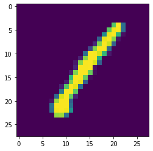
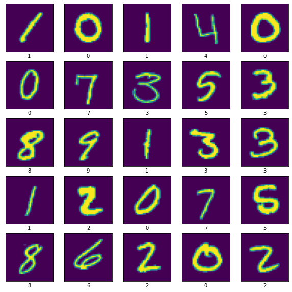
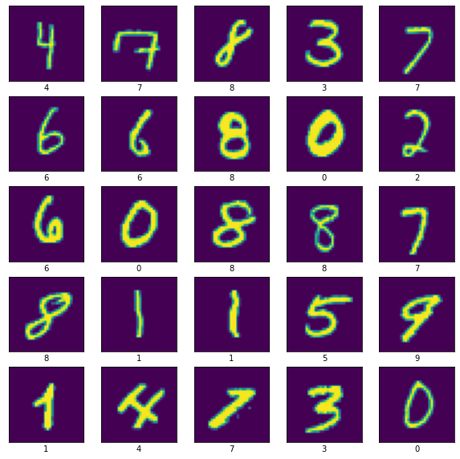
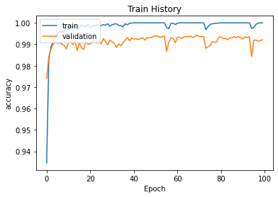
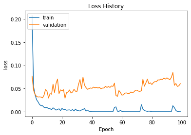

# KAGGLE-Digit-Recognizer
kaggle: https://www.kaggle.com/c/digit-recognizer/overview

**Public Score**: 0.99164


```python
# This Python 3 environment comes with many helpful analytics libraries installed
# It is defined by the kaggle/python Docker image: https://github.com/kaggle/docker-python
# For example, here's several helpful packages to load

import numpy as np # linear algebra
import pandas as pd # data processing, CSV file I/O (e.g. pd.read_csv)

# Input data files are available in the read-only "../input/" directory
# For example, running this (by clicking run or pressing Shift+Enter) will list all files under the input directory

import os
for dirname, _, filenames in os.walk('/kaggle/input'):
    for filename in filenames:
        print(os.path.join(dirname, filename))

# You can write up to 20GB to the current directory (/kaggle/working/) that gets preserved as output when you create a version using "Save & Run All" 
# You can also write temporary files to /kaggle/temp/, but they won't be saved outside of the current session
```

    /kaggle/input/digit-recognizer/sample_submission.csv
    /kaggle/input/digit-recognizer/train.csv
    /kaggle/input/digit-recognizer/test.csv
    


```python
import numpy as np
import matplotlib.pyplot as plt
from matplotlib.image import imread
import pandas as pd
from sklearn.model_selection import train_test_split
import tensorflow as tf
from tensorflow.keras import layers
import keras
# from keras.models import Sequential
# from keras.layers import Dense, Dropout, Conv2D, MaxPool2D, Flatten, BatchNormalization, Activation
from keras import backend as K
```


```python
training_path = "/kaggle/input/digit-recognizer/train.csv"
testing_path = "/kaggle/input/digit-recognizer/test.csv"

epoch = 100
batchsize = 64
image_size = 28
image_size_pad = 32
```


```python
data = pd.read_csv(training_path)
data.head()

data_test = pd.read_csv(testing_path)
data_test.head()
```


<div>
<style scoped>
    .dataframe tbody tr th:only-of-type {
        vertical-align: middle;
    }

    .dataframe tbody tr th {
        vertical-align: top;
    }

    .dataframe thead th {
        text-align: right;
    }
</style>
<table border="1" class="dataframe">
  <thead>
    <tr style="text-align: right;">
      <th></th>
      <th>pixel0</th>
      <th>pixel1</th>
      <th>pixel2</th>
      <th>pixel3</th>
      <th>pixel4</th>
      <th>pixel5</th>
      <th>pixel6</th>
      <th>pixel7</th>
      <th>pixel8</th>
      <th>pixel9</th>
      <th>...</th>
      <th>pixel774</th>
      <th>pixel775</th>
      <th>pixel776</th>
      <th>pixel777</th>
      <th>pixel778</th>
      <th>pixel779</th>
      <th>pixel780</th>
      <th>pixel781</th>
      <th>pixel782</th>
      <th>pixel783</th>
    </tr>
  </thead>
  <tbody>
    <tr>
      <th>0</th>
      <td>0</td>
      <td>0</td>
      <td>0</td>
      <td>0</td>
      <td>0</td>
      <td>0</td>
      <td>0</td>
      <td>0</td>
      <td>0</td>
      <td>0</td>
      <td>...</td>
      <td>0</td>
      <td>0</td>
      <td>0</td>
      <td>0</td>
      <td>0</td>
      <td>0</td>
      <td>0</td>
      <td>0</td>
      <td>0</td>
      <td>0</td>
    </tr>
    <tr>
      <th>1</th>
      <td>0</td>
      <td>0</td>
      <td>0</td>
      <td>0</td>
      <td>0</td>
      <td>0</td>
      <td>0</td>
      <td>0</td>
      <td>0</td>
      <td>0</td>
      <td>...</td>
      <td>0</td>
      <td>0</td>
      <td>0</td>
      <td>0</td>
      <td>0</td>
      <td>0</td>
      <td>0</td>
      <td>0</td>
      <td>0</td>
      <td>0</td>
    </tr>
    <tr>
      <th>2</th>
      <td>0</td>
      <td>0</td>
      <td>0</td>
      <td>0</td>
      <td>0</td>
      <td>0</td>
      <td>0</td>
      <td>0</td>
      <td>0</td>
      <td>0</td>
      <td>...</td>
      <td>0</td>
      <td>0</td>
      <td>0</td>
      <td>0</td>
      <td>0</td>
      <td>0</td>
      <td>0</td>
      <td>0</td>
      <td>0</td>
      <td>0</td>
    </tr>
    <tr>
      <th>3</th>
      <td>0</td>
      <td>0</td>
      <td>0</td>
      <td>0</td>
      <td>0</td>
      <td>0</td>
      <td>0</td>
      <td>0</td>
      <td>0</td>
      <td>0</td>
      <td>...</td>
      <td>0</td>
      <td>0</td>
      <td>0</td>
      <td>0</td>
      <td>0</td>
      <td>0</td>
      <td>0</td>
      <td>0</td>
      <td>0</td>
      <td>0</td>
    </tr>
    <tr>
      <th>4</th>
      <td>0</td>
      <td>0</td>
      <td>0</td>
      <td>0</td>
      <td>0</td>
      <td>0</td>
      <td>0</td>
      <td>0</td>
      <td>0</td>
      <td>0</td>
      <td>...</td>
      <td>0</td>
      <td>0</td>
      <td>0</td>
      <td>0</td>
      <td>0</td>
      <td>0</td>
      <td>0</td>
      <td>0</td>
      <td>0</td>
      <td>0</td>
    </tr>
  </tbody>
</table>
<p>5 rows × 784 columns</p>
</div>


```python
y_train = data.loc[:, "label"]
x_train = data.iloc[:, 1:]

x_test = data_test.iloc[:, :]

print("Training set:", x_train.shape)
print("Training set labels:", y_train.shape)

print("Testing set:", x_test.shape)
```

    Training set: (42000, 784)
    Training set labels: (42000,)
    Testing set: (28000, 784)
    


```python
x_train = x_train.values.reshape(-1, image_size, image_size, 1)
x_test = x_test.values.reshape(-1, image_size, image_size, 1)

print(x_train.shape)
print(x_test.shape)
```

    (42000, 28, 28, 1)
    (28000, 28, 28, 1)
    


```python
plt.imshow(x_train[0])
print(y_train[0])
```

    1
    





```python
x_train = x_train.astype('float32')
x_test = x_test.astype('float32')
```


```python
#做padding，使符合32x32 (為了符合LeNet)

x_train = tf.pad(x_train,[[0,0],[2,2],[2,2],[0,0]])
x_test = tf.pad(x_test,[[0,0],[2,2],[2,2],[0,0]])
```


```python
print(x_train.shape)
```

    (42000, 32, 32, 1)
    


```python
num = x_train.shape[0] // 10
train_data, val_data = tf.split(x_train,[num*9, num])
train_label, val_label = tf.split(y_train,[num*9, num])
```


```python
plt.figure(figsize=(10,10))

for i in range(25):
    plt.subplot(5,5,i+1)
    plt.imshow(train_data[i])
    plt.xticks([])
    plt.yticks([])
    plt.xlabel(train_label[i].numpy())
```





```python
# 不做one-hot encoding
# train_label = keras.utils.to_categorical(train_label)
# val_label = keras.utils.to_categorical(val_label)

# print(train_label[0])
```


```python
train_ds = tf.data.Dataset.from_tensor_slices((train_data,train_label)).shuffle(33600,seed=42).batch(128)
val_ds = tf.data.Dataset.from_tensor_slices((val_data,val_label)).shuffle(33600,seed=42).batch(128)
```


```python
plt.figure(figsize=(10,10))

for image,label in train_ds.take(1):
    for i in range(25):
        plt.subplot(5,5,i+1)
        plt.imshow(image[i])
        plt.xticks([])
        plt.yticks([])
        plt.xlabel(label[i].numpy())
```





## from Digit Recognizer Accuracy 99.3%
https://www.kaggle.com/greynolan/digit-recognizer-accuracy-99-3

使用 
- LeNet-style neural network
- Monte-Carlo Dropout
- SparseCategoricalCrossentropy

### LeNet (1998)

LeNet 是由 Yann LeCun 團隊提出的網路架構，是卷積神經網路的始祖。

其架構由**兩個卷積層、池化層、全連接層以及最後一層 Gaussian 連接層所組成**，早期用來辨識手寫數字圖像

由下圖可以看到 LeNet 的網路架構共有七層：
- 卷積層 (Convolutions, C1)、
- 池化層 (Subsampling, S2)、
- 卷積層 (C3)、池化層 (S4)、
- 全連接卷積層 (C5)、
- 全連接層 (F6)、
- Gaussian 連接層 (output)


輸入層是一個 32x32 的圖片，而 Filter size 皆為 5x5，第一個 Filter 與第二個 Filter 的輸出通道分別為 6、16，並且皆使用 Sigmoid 作為激活函數。

池化層的窗口為 2x2，stride 為 2，使用平均池化進行採樣。最後的全連接層的神經元數量分別是 120、84 個。

最後一層輸出層是 Gaussian連接層，採用 RBF 函數 (radial basis function, 徑向歐式距離函數)，計算輸入向量和參數向量之間的歐式距離。因為 LeNet 應用於辨識手寫圖像，數字為0~9，所以輸出層為 10 個神經元

from: https://medium.com/ching-i/%E5%8D%B7%E7%A9%8D%E7%A5%9E%E7%B6%93%E7%B6%B2%E7%B5%A1-cnn-%E7%B6%93%E5%85%B8%E6%A8%A1%E5%9E%8B-lenet-alexnet-vgg-nin-with-pytorch-code-84462d6cf60c


```python
# Use Monte-Carlo Dropout to reduce overfitting
class MCDropout(layers.Dropout):
    def call(self,inputs):
        return super().call(inputs,training=True)
```


```python
inputs = layers.Input(shape=(image_size_pad, image_size_pad, 1))
x = layers.experimental.preprocessing.Rescaling(1./255)(inputs)
x = layers.Conv2D(128,5,strides=1,activation='relu')(x)
x = layers.MaxPooling2D(2,strides=2)(x)
x = layers.Conv2D(128,5,strides=1,activation='relu')(x)
x = layers.MaxPooling2D(2,strides=2)(x)
x = layers.Conv2D(128,5,strides=1,activation='relu')(x)
x = layers.Flatten()(x)
x = layers.Dense(84,activation='relu')(x)
x = MCDropout(0.1)(x)
outputs = layers.Dense(10)(x)

model = keras.Model(inputs,outputs)
model.summary()
```

    Model: "model"
    _________________________________________________________________
    Layer (type)                 Output Shape              Param #   
    =================================================================
    input_1 (InputLayer)         [(None, 32, 32, 1)]       0         
    _________________________________________________________________
    rescaling (Rescaling)        (None, 32, 32, 1)         0         
    _________________________________________________________________
    conv2d (Conv2D)              (None, 28, 28, 128)       3328      
    _________________________________________________________________
    max_pooling2d (MaxPooling2D) (None, 14, 14, 128)       0         
    _________________________________________________________________
    conv2d_1 (Conv2D)            (None, 10, 10, 128)       409728    
    _________________________________________________________________
    max_pooling2d_1 (MaxPooling2 (None, 5, 5, 128)         0         
    _________________________________________________________________
    conv2d_2 (Conv2D)            (None, 1, 1, 128)         409728    
    _________________________________________________________________
    flatten (Flatten)            (None, 128)               0         
    _________________________________________________________________
    dense (Dense)                (None, 84)                10836     
    _________________________________________________________________
    mc_dropout (MCDropout)       (None, 84)                0         
    _________________________________________________________________
    dense_1 (Dense)              (None, 10)                850       
    =================================================================
    Total params: 834,470
    Trainable params: 834,470
    Non-trainable params: 0
    _________________________________________________________________
    


```python
model.compile(loss=keras.losses.SparseCategoricalCrossentropy(from_logits=True), 
              optimizer='adam', 
              metrics=['accuracy'])
```


```python
# Using EarlyStopping, end training when val_accuracy is not improved for 10 consecutive times
early_stopping = keras.callbacks.EarlyStopping(monitor='val_accuracy',mode='max',
                                    patience=10,restore_best_weights=True)

# Using ReduceLROnPlateau, the learning rate is reduced by half when val_accuracy is not improved for 5 consecutive times
lr_scheduler = keras.callbacks.ReduceLROnPlateau(monitor='val_accuracy',mode='max',factor=0.5,patience=5)
```


```python
h = model.fit(train_ds, epochs=epoch, 
              batch_size=batchsize, verbose=1, 
              validation_data=val_ds)
```

    Epoch 1/100
    296/296 [==============================] - 6s 11ms/step - loss: 0.4914 - accuracy: 0.8399 - val_loss: 0.0768 - val_accuracy: 0.9740
    Epoch 2/100
    296/296 [==============================] - 3s 9ms/step - loss: 0.0589 - accuracy: 0.9815 - val_loss: 0.0459 - val_accuracy: 0.9843
    Epoch 3/100
    296/296 [==============================] - 3s 9ms/step - loss: 0.0370 - accuracy: 0.9880 - val_loss: 0.0374 - val_accuracy: 0.9879
    Epoch 4/100
    296/296 [==============================] - 3s 9ms/step - loss: 0.0252 - accuracy: 0.9916 - val_loss: 0.0329 - val_accuracy: 0.9900
    Epoch 5/100
    296/296 [==============================] - 3s 9ms/step - loss: 0.0219 - accuracy: 0.9934 - val_loss: 0.0317 - val_accuracy: 0.9910
    Epoch 6/100
    296/296 [==============================] - 3s 9ms/step - loss: 0.0136 - accuracy: 0.9955 - val_loss: 0.0320 - val_accuracy: 0.9905
    Epoch 7/100
    296/296 [==============================] - 3s 9ms/step - loss: 0.0117 - accuracy: 0.9963 - val_loss: 0.0315 - val_accuracy: 0.9907
    Epoch 8/100
    296/296 [==============================] - 3s 9ms/step - loss: 0.0113 - accuracy: 0.9958 - val_loss: 0.0298 - val_accuracy: 0.9900
    Epoch 9/100
    296/296 [==============================] - 3s 9ms/step - loss: 0.0083 - accuracy: 0.9967 - val_loss: 0.0357 - val_accuracy: 0.9895
    Epoch 10/100
    296/296 [==============================] - 3s 9ms/step - loss: 0.0087 - accuracy: 0.9974 - val_loss: 0.0480 - val_accuracy: 0.9879
    Epoch 11/100
    296/296 [==============================] - 3s 9ms/step - loss: 0.0088 - accuracy: 0.9971 - val_loss: 0.0437 - val_accuracy: 0.9907
    Epoch 12/100
    296/296 [==============================] - 3s 9ms/step - loss: 0.0075 - accuracy: 0.9977 - val_loss: 0.0294 - val_accuracy: 0.9912
    Epoch 13/100
    296/296 [==============================] - 3s 9ms/step - loss: 0.0064 - accuracy: 0.9980 - val_loss: 0.0390 - val_accuracy: 0.9898
    Epoch 14/100
    296/296 [==============================] - 3s 9ms/step - loss: 0.0032 - accuracy: 0.9989 - val_loss: 0.0376 - val_accuracy: 0.9917
    Epoch 15/100
    296/296 [==============================] - 3s 9ms/step - loss: 0.0087 - accuracy: 0.9971 - val_loss: 0.0593 - val_accuracy: 0.9871
    Epoch 16/100
    296/296 [==============================] - 3s 9ms/step - loss: 0.0071 - accuracy: 0.9971 - val_loss: 0.0412 - val_accuracy: 0.9907
    Epoch 17/100
    296/296 [==============================] - 3s 9ms/step - loss: 0.0035 - accuracy: 0.9988 - val_loss: 0.0608 - val_accuracy: 0.9883
    Epoch 18/100
    296/296 [==============================] - 3s 9ms/step - loss: 0.0050 - accuracy: 0.9983 - val_loss: 0.0704 - val_accuracy: 0.9876
    Epoch 19/100
    296/296 [==============================] - 3s 9ms/step - loss: 0.0083 - accuracy: 0.9979 - val_loss: 0.0390 - val_accuracy: 0.9914
    Epoch 20/100
    296/296 [==============================] - 3s 9ms/step - loss: 0.0018 - accuracy: 0.9995 - val_loss: 0.0471 - val_accuracy: 0.9900
    Epoch 21/100
    296/296 [==============================] - 3s 9ms/step - loss: 0.0052 - accuracy: 0.9984 - val_loss: 0.0450 - val_accuracy: 0.9902
    Epoch 22/100
    296/296 [==============================] - 3s 9ms/step - loss: 0.0035 - accuracy: 0.9989 - val_loss: 0.0475 - val_accuracy: 0.9907
    Epoch 23/100
    296/296 [==============================] - 3s 9ms/step - loss: 0.0039 - accuracy: 0.9989 - val_loss: 0.0292 - val_accuracy: 0.9921
    Epoch 24/100
    296/296 [==============================] - 3s 8ms/step - loss: 0.0035 - accuracy: 0.9990 - val_loss: 0.0409 - val_accuracy: 0.9905
    Epoch 25/100
    296/296 [==============================] - 3s 8ms/step - loss: 0.0035 - accuracy: 0.9990 - val_loss: 0.0425 - val_accuracy: 0.9912
    Epoch 26/100
    296/296 [==============================] - 3s 9ms/step - loss: 0.0025 - accuracy: 0.9992 - val_loss: 0.0469 - val_accuracy: 0.9902
    Epoch 27/100
    296/296 [==============================] - 3s 9ms/step - loss: 0.0030 - accuracy: 0.9991 - val_loss: 0.0402 - val_accuracy: 0.9926
    Epoch 28/100
    296/296 [==============================] - 3s 9ms/step - loss: 0.0037 - accuracy: 0.9990 - val_loss: 0.0422 - val_accuracy: 0.9914
    Epoch 29/100
    296/296 [==============================] - 3s 9ms/step - loss: 7.8909e-04 - accuracy: 0.9997 - val_loss: 0.0484 - val_accuracy: 0.9898
    Epoch 30/100
    296/296 [==============================] - 3s 9ms/step - loss: 0.0042 - accuracy: 0.9989 - val_loss: 0.0440 - val_accuracy: 0.9919
    Epoch 31/100
    296/296 [==============================] - 3s 8ms/step - loss: 0.0020 - accuracy: 0.9992 - val_loss: 0.0438 - val_accuracy: 0.9912
    Epoch 32/100
    296/296 [==============================] - 3s 9ms/step - loss: 0.0015 - accuracy: 0.9997 - val_loss: 0.0589 - val_accuracy: 0.9905
    Epoch 33/100
    296/296 [==============================] - 3s 9ms/step - loss: 0.0015 - accuracy: 0.9997 - val_loss: 0.0693 - val_accuracy: 0.9886
    Epoch 34/100
    296/296 [==============================] - 3s 9ms/step - loss: 0.0032 - accuracy: 0.9989 - val_loss: 0.0498 - val_accuracy: 0.9902
    Epoch 35/100
    296/296 [==============================] - 3s 9ms/step - loss: 0.0065 - accuracy: 0.9984 - val_loss: 0.0747 - val_accuracy: 0.9893
    Epoch 36/100
    296/296 [==============================] - 3s 9ms/step - loss: 0.0079 - accuracy: 0.9980 - val_loss: 0.0574 - val_accuracy: 0.9907
    Epoch 37/100
    296/296 [==============================] - 3s 9ms/step - loss: 0.0011 - accuracy: 0.9997 - val_loss: 0.0520 - val_accuracy: 0.9919
    Epoch 38/100
    296/296 [==============================] - 3s 9ms/step - loss: 0.0042 - accuracy: 0.9990 - val_loss: 0.0483 - val_accuracy: 0.9931
    Epoch 39/100
    296/296 [==============================] - 3s 8ms/step - loss: 0.0014 - accuracy: 0.9998 - val_loss: 0.0497 - val_accuracy: 0.9917
    Epoch 40/100
    296/296 [==============================] - 3s 9ms/step - loss: 6.0495e-04 - accuracy: 0.9998 - val_loss: 0.0511 - val_accuracy: 0.9929
    Epoch 41/100
    296/296 [==============================] - 3s 9ms/step - loss: 1.8483e-05 - accuracy: 1.0000 - val_loss: 0.0504 - val_accuracy: 0.9924
    Epoch 42/100
    296/296 [==============================] - 3s 9ms/step - loss: 2.5386e-05 - accuracy: 1.0000 - val_loss: 0.0530 - val_accuracy: 0.9926
    Epoch 43/100
    296/296 [==============================] - 3s 9ms/step - loss: 1.6798e-05 - accuracy: 1.0000 - val_loss: 0.0515 - val_accuracy: 0.9921
    Epoch 44/100
    296/296 [==============================] - 3s 9ms/step - loss: 6.9448e-06 - accuracy: 1.0000 - val_loss: 0.0525 - val_accuracy: 0.9926
    Epoch 45/100
    296/296 [==============================] - 3s 8ms/step - loss: 9.3016e-06 - accuracy: 1.0000 - val_loss: 0.0511 - val_accuracy: 0.9931
    Epoch 46/100
    296/296 [==============================] - 3s 9ms/step - loss: 5.1997e-06 - accuracy: 1.0000 - val_loss: 0.0523 - val_accuracy: 0.9919
    Epoch 47/100
    296/296 [==============================] - 3s 9ms/step - loss: 2.8577e-06 - accuracy: 1.0000 - val_loss: 0.0495 - val_accuracy: 0.9931
    Epoch 48/100
    296/296 [==============================] - 3s 9ms/step - loss: 3.2858e-06 - accuracy: 1.0000 - val_loss: 0.0509 - val_accuracy: 0.9931
    Epoch 49/100
    296/296 [==============================] - 3s 8ms/step - loss: 3.5315e-06 - accuracy: 1.0000 - val_loss: 0.0511 - val_accuracy: 0.9931
    Epoch 50/100
    296/296 [==============================] - 3s 9ms/step - loss: 1.3955e-06 - accuracy: 1.0000 - val_loss: 0.0547 - val_accuracy: 0.9938
    Epoch 51/100
    296/296 [==============================] - 3s 9ms/step - loss: 1.2109e-06 - accuracy: 1.0000 - val_loss: 0.0523 - val_accuracy: 0.9938
    Epoch 52/100
    296/296 [==============================] - 3s 8ms/step - loss: 1.1653e-06 - accuracy: 1.0000 - val_loss: 0.0543 - val_accuracy: 0.9938
    Epoch 53/100
    296/296 [==============================] - 3s 9ms/step - loss: 1.0498e-06 - accuracy: 1.0000 - val_loss: 0.0523 - val_accuracy: 0.9931
    Epoch 54/100
    296/296 [==============================] - 3s 9ms/step - loss: 8.8609e-07 - accuracy: 1.0000 - val_loss: 0.0555 - val_accuracy: 0.9936
    Epoch 55/100
    296/296 [==============================] - 3s 9ms/step - loss: 5.3182e-07 - accuracy: 1.0000 - val_loss: 0.0546 - val_accuracy: 0.9938
    Epoch 56/100
    296/296 [==============================] - 3s 9ms/step - loss: 0.0013 - accuracy: 0.9997 - val_loss: 0.0616 - val_accuracy: 0.9867
    Epoch 57/100
    296/296 [==============================] - 3s 9ms/step - loss: 0.0162 - accuracy: 0.9961 - val_loss: 0.0350 - val_accuracy: 0.9910
    Epoch 58/100
    296/296 [==============================] - 3s 9ms/step - loss: 7.1340e-04 - accuracy: 0.9997 - val_loss: 0.0330 - val_accuracy: 0.9931
    Epoch 59/100
    296/296 [==============================] - 3s 9ms/step - loss: 4.9309e-04 - accuracy: 0.9998 - val_loss: 0.0456 - val_accuracy: 0.9926
    Epoch 60/100
    296/296 [==============================] - 3s 8ms/step - loss: 0.0030 - accuracy: 0.9992 - val_loss: 0.0413 - val_accuracy: 0.9907
    Epoch 61/100
    296/296 [==============================] - 3s 9ms/step - loss: 4.7637e-04 - accuracy: 0.9998 - val_loss: 0.0357 - val_accuracy: 0.9933
    Epoch 62/100
    296/296 [==============================] - 3s 9ms/step - loss: 5.8463e-05 - accuracy: 1.0000 - val_loss: 0.0363 - val_accuracy: 0.9933
    Epoch 63/100
    296/296 [==============================] - 3s 9ms/step - loss: 1.3620e-05 - accuracy: 1.0000 - val_loss: 0.0401 - val_accuracy: 0.9926
    Epoch 64/100
    296/296 [==============================] - 3s 8ms/step - loss: 1.6421e-05 - accuracy: 1.0000 - val_loss: 0.0404 - val_accuracy: 0.9936
    Epoch 65/100
    296/296 [==============================] - 3s 9ms/step - loss: 1.3197e-05 - accuracy: 1.0000 - val_loss: 0.0392 - val_accuracy: 0.9936
    Epoch 66/100
    296/296 [==============================] - 3s 9ms/step - loss: 8.2324e-06 - accuracy: 1.0000 - val_loss: 0.0395 - val_accuracy: 0.9936
    Epoch 67/100
    296/296 [==============================] - 3s 8ms/step - loss: 3.6017e-06 - accuracy: 1.0000 - val_loss: 0.0426 - val_accuracy: 0.9938
    Epoch 68/100
    296/296 [==============================] - 3s 8ms/step - loss: 1.6292e-06 - accuracy: 1.0000 - val_loss: 0.0405 - val_accuracy: 0.9931
    Epoch 69/100
    296/296 [==============================] - 3s 9ms/step - loss: 2.3378e-06 - accuracy: 1.0000 - val_loss: 0.0427 - val_accuracy: 0.9936
    Epoch 70/100
    296/296 [==============================] - 3s 8ms/step - loss: 3.5282e-06 - accuracy: 1.0000 - val_loss: 0.0462 - val_accuracy: 0.9943
    Epoch 71/100
    296/296 [==============================] - 3s 9ms/step - loss: 1.2837e-06 - accuracy: 1.0000 - val_loss: 0.0464 - val_accuracy: 0.9936
    Epoch 72/100
    296/296 [==============================] - 3s 9ms/step - loss: 3.4526e-06 - accuracy: 1.0000 - val_loss: 0.0443 - val_accuracy: 0.9936
    Epoch 73/100
    296/296 [==============================] - 3s 9ms/step - loss: 1.0312e-06 - accuracy: 1.0000 - val_loss: 0.0437 - val_accuracy: 0.9936
    Epoch 74/100
    296/296 [==============================] - 3s 9ms/step - loss: 0.0041 - accuracy: 0.9992 - val_loss: 0.0453 - val_accuracy: 0.9881
    Epoch 75/100
    296/296 [==============================] - 3s 8ms/step - loss: 0.0056 - accuracy: 0.9980 - val_loss: 0.0700 - val_accuracy: 0.9888
    Epoch 76/100
    296/296 [==============================] - 3s 9ms/step - loss: 0.0032 - accuracy: 0.9989 - val_loss: 0.0549 - val_accuracy: 0.9895
    Epoch 77/100
    296/296 [==============================] - 3s 9ms/step - loss: 0.0023 - accuracy: 0.9994 - val_loss: 0.0623 - val_accuracy: 0.9912
    Epoch 78/100
    296/296 [==============================] - 3s 9ms/step - loss: 5.0012e-04 - accuracy: 0.9997 - val_loss: 0.0702 - val_accuracy: 0.9910
    Epoch 79/100
    296/296 [==============================] - 3s 9ms/step - loss: 4.4265e-04 - accuracy: 0.9999 - val_loss: 0.0601 - val_accuracy: 0.9912
    Epoch 80/100
    296/296 [==============================] - 3s 8ms/step - loss: 7.0123e-04 - accuracy: 0.9999 - val_loss: 0.0623 - val_accuracy: 0.9933
    Epoch 81/100
    296/296 [==============================] - 3s 9ms/step - loss: 2.2416e-05 - accuracy: 1.0000 - val_loss: 0.0586 - val_accuracy: 0.9933
    Epoch 82/100
    296/296 [==============================] - 3s 9ms/step - loss: 6.2585e-06 - accuracy: 1.0000 - val_loss: 0.0628 - val_accuracy: 0.9926
    Epoch 83/100
    296/296 [==============================] - 3s 9ms/step - loss: 3.5105e-06 - accuracy: 1.0000 - val_loss: 0.0650 - val_accuracy: 0.9929
    Epoch 84/100
    296/296 [==============================] - 3s 9ms/step - loss: 4.3877e-06 - accuracy: 1.0000 - val_loss: 0.0645 - val_accuracy: 0.9921
    Epoch 85/100
    296/296 [==============================] - 3s 9ms/step - loss: 1.5702e-06 - accuracy: 1.0000 - val_loss: 0.0686 - val_accuracy: 0.9929
    Epoch 86/100
    296/296 [==============================] - 3s 9ms/step - loss: 2.9462e-06 - accuracy: 1.0000 - val_loss: 0.0684 - val_accuracy: 0.9931
    Epoch 87/100
    296/296 [==============================] - 3s 9ms/step - loss: 3.8677e-06 - accuracy: 1.0000 - val_loss: 0.0704 - val_accuracy: 0.9936
    Epoch 88/100
    296/296 [==============================] - 3s 9ms/step - loss: 1.2239e-06 - accuracy: 1.0000 - val_loss: 0.0694 - val_accuracy: 0.9931
    Epoch 89/100
    296/296 [==============================] - 3s 9ms/step - loss: 1.0258e-06 - accuracy: 1.0000 - val_loss: 0.0724 - val_accuracy: 0.9936
    Epoch 90/100
    296/296 [==============================] - 3s 9ms/step - loss: 1.6686e-06 - accuracy: 1.0000 - val_loss: 0.0704 - val_accuracy: 0.9931
    Epoch 91/100
    296/296 [==============================] - 3s 8ms/step - loss: 6.3694e-07 - accuracy: 1.0000 - val_loss: 0.0731 - val_accuracy: 0.9924
    Epoch 92/100
    296/296 [==============================] - 3s 8ms/step - loss: 9.0824e-07 - accuracy: 1.0000 - val_loss: 0.0710 - val_accuracy: 0.9936
    Epoch 93/100
    296/296 [==============================] - 3s 9ms/step - loss: 7.0706e-07 - accuracy: 1.0000 - val_loss: 0.0691 - val_accuracy: 0.9931
    Epoch 94/100
    296/296 [==============================] - 3s 9ms/step - loss: 1.0850e-06 - accuracy: 1.0000 - val_loss: 0.0741 - val_accuracy: 0.9936
    Epoch 95/100
    296/296 [==============================] - 3s 8ms/step - loss: 0.0028 - accuracy: 0.9995 - val_loss: 0.0846 - val_accuracy: 0.9843
    Epoch 96/100
    296/296 [==============================] - 3s 9ms/step - loss: 0.0112 - accuracy: 0.9973 - val_loss: 0.0569 - val_accuracy: 0.9919
    Epoch 97/100
    296/296 [==============================] - 3s 10ms/step - loss: 0.0032 - accuracy: 0.9992 - val_loss: 0.0609 - val_accuracy: 0.9919
    Epoch 98/100
    296/296 [==============================] - 3s 8ms/step - loss: 4.3218e-04 - accuracy: 0.9998 - val_loss: 0.0545 - val_accuracy: 0.9914
    Epoch 99/100
    296/296 [==============================] - 3s 9ms/step - loss: 1.3307e-04 - accuracy: 1.0000 - val_loss: 0.0559 - val_accuracy: 0.9917
    Epoch 100/100
    296/296 [==============================] - 3s 9ms/step - loss: 8.8320e-06 - accuracy: 1.0000 - val_loss: 0.0605 - val_accuracy: 0.9921
    


```python
print(h.history.keys())
print("Acc:", h.history['accuracy'][-1])
print("Val Acc:", h.history['val_accuracy'][-1])

def show_train_history(train_history, train, validation, title):  
    plt.plot(train_history.history[train])  
    plt.plot(train_history.history[validation])  
    plt.title(title)  
    plt.ylabel(train)  
    plt.xlabel('Epoch')  
    plt.legend(['train', 'validation'], loc='upper left')  
    plt.show() 

show_train_history(h, 'accuracy', 'val_accuracy', 'Train History') 
show_train_history(h, 'loss', 'val_loss', 'Loss History')  
```

    dict_keys(['loss', 'accuracy', 'val_loss', 'val_accuracy'])
    Acc: 1.0
    Val Acc: 0.9921428561210632
    








```python
predictions = model.predict(x_test)
predictions = np.argmax(predictions,axis=1)

print(predictions[:5])
```

    [2 0 9 9 3]
    


```python
ids = range(1, (len(predictions)+1))

submission = pd.DataFrame({
    "ImageId": ids, 
    "Label": predictions,
})

submission.to_csv("submission.csv", index = False)
```


```python

```
